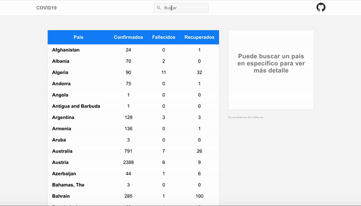

# SPA Covid-19
Single Page Applications desarrollada con ReactJs, consume información de la [**API covit-19**](https://covid19api.com/)

## Feactures
-	ReactJs
-	Echarts

## Getting started
1. Clonar el repositorio.
2. Instalar dependencias de npm `npm install`
3. Ejecutar `npm run start`
4. Abrir en el navegador [http//localhost:3000/](http://localhost:3000)

## License
This project is licensed under the MIT License - see the [LICENSE](https://opensource.org/licenses/MIT) page for details.